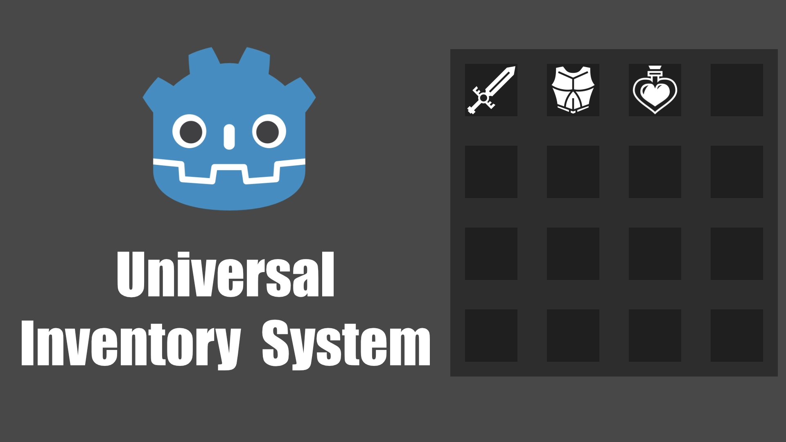
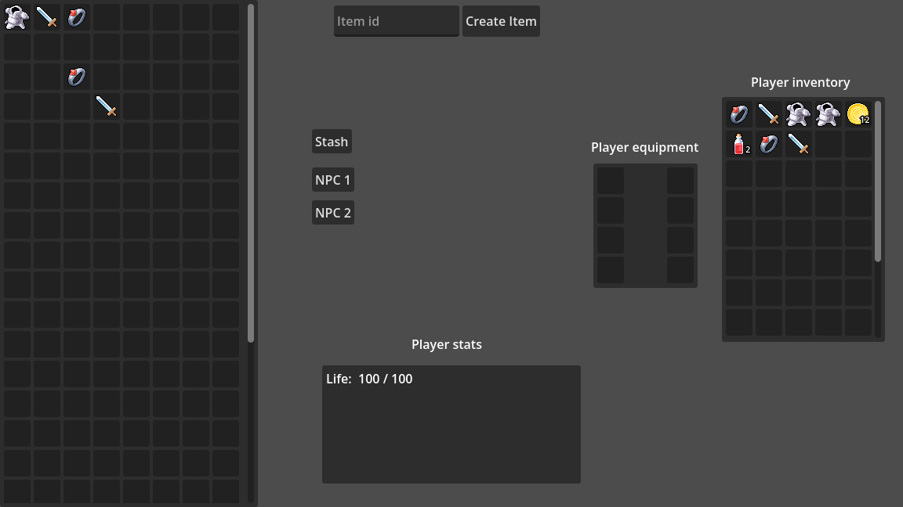
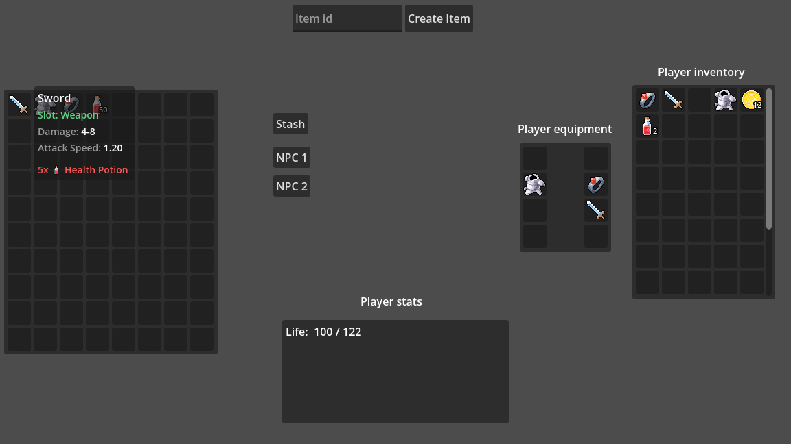
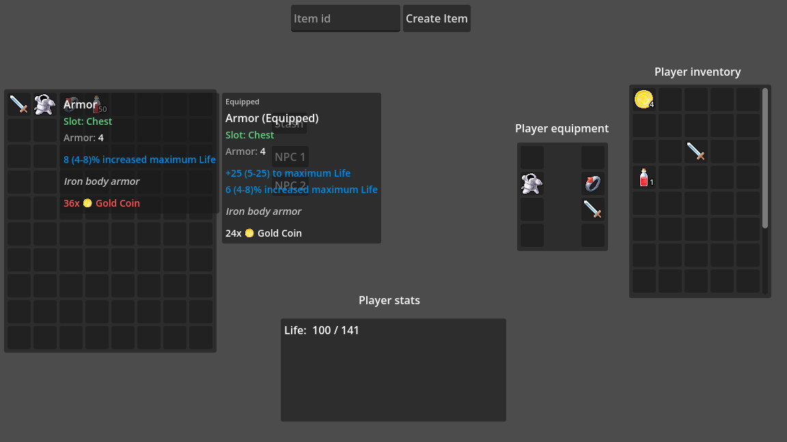
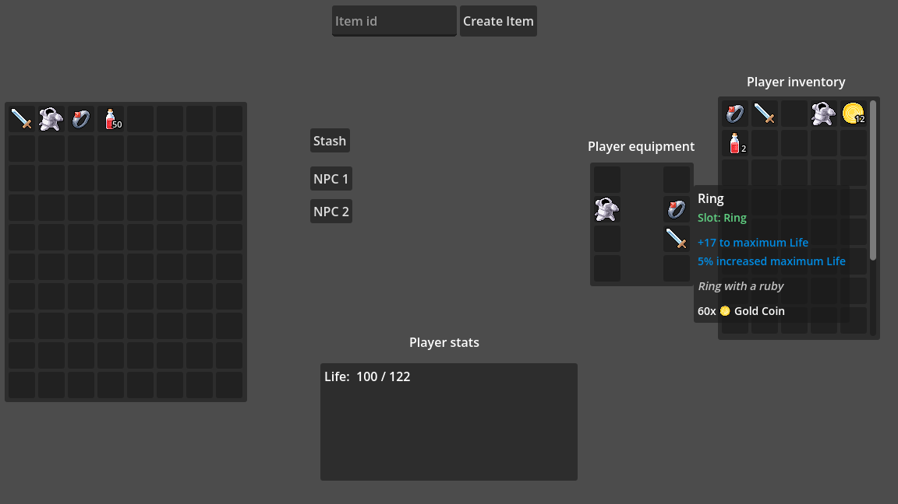
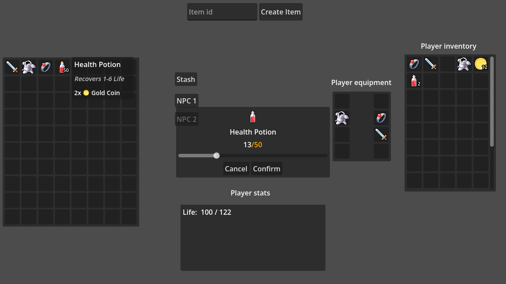

# Godot Inventory System

 

## About

Example project including scripts and nodes for building inventories, equipments, NPC trading and all sorts of containers for items.

## Features

- Universal inventory system
- Equipment system
- Itemization system
- Affixes system
- Item tooltip system
- Vendor (NPC trading) system

## Example

Checkout [Example](example) scene for a quick glance on how the system works.

## Installation

Copy `scripts` and `scenes`, add `scenes/inventory_system`, `scenes/affix_pool`, `scenes/item_tooltip` scenes to your Autoload (in that order)

## API Docs

Visit [Wiki](https://github.com/Oen44/Godot-Inventory/wiki) for documentation.

